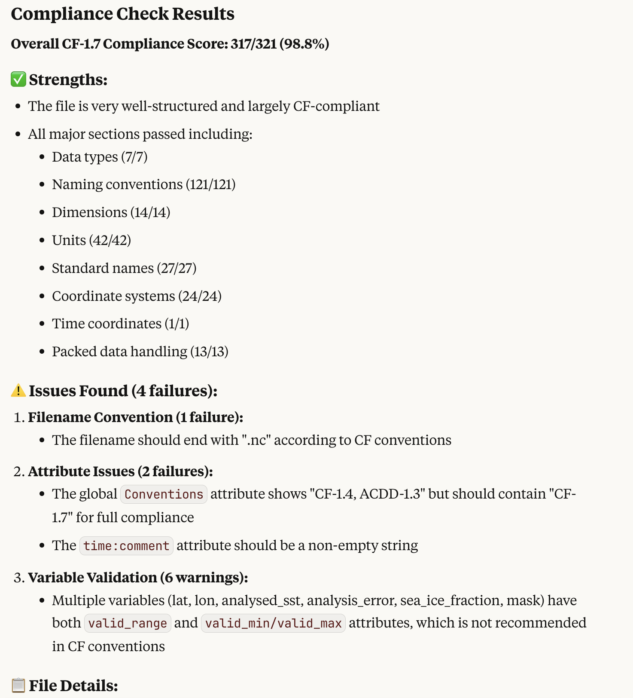

# Model Context Protocol (MCP) for NASA Metadata Compliance Checker (MCC)

This module is a [model context protocol](https://modelcontextprotocol.io/introduction) (MCP) for NASA's Metadata Compliance Checker (MCC). The goal of this MCP server is to integrate AI agents with the Metadata Compliance Service, enabling automated file compliance checking against standards like CF (Climate and Forecast) conventions.

## Dependencies
uv -  a rust based python package manager
a LLM client, such as Claude desktop or chatGPT desktop (for consuming the MCP)

## Install and Run

Clone the repository to your local environment, or where your LLM client is running.


### Install uv 

```
curl -LsSf https://astral.sh/uv/install.sh | sh
```


```
uv venv
source .venv/bin/activate
```

###  Install packages with uv
```
uv sync
```

use the outputs of `which uv` (UV_LIB) and `PWD` (MCC_MCP_INSTALL) to update the following configuration.


## Adding to AI Framework

In this example we'll use Claude desktop.

Update the `claude_desktop_config.json` file (sometimes this must be created). On a mac, this is often found in `~/Library/Application\ Support/Claude/claude_desktop_config.json`

Add the following configuration, filling in the values of UV_LIB and MCC_MCP_INSTALL - don't use environment variables here.

```
{
    "mcpServers": {
        "mcc": {
            "command": "$UV_LIB$",
            "args": [
                "--directory",
                "$MCC_MCP_INSTALL$",
                "run",
                "mcc.py"
            ]
        }
    }
}
```

## Use the MCP Server

Simply prompt your agent to check file compliance using the MCC service. For example:

- "Check the compliance of my NetCDF file against CF 1.7 standards"
- "Validate this file using the Metadata Compliance Checker"

The MCP provides a `check_compliance` tool that accepts:
- `file_path`: Local path to the file to check
- `compliance`: Compliance standard (e.g., "CF", "GDS2") 
- `compliance_version`: Version of the standard (e.g., "1.7")

Example usage:

```
Check compliance for /path/to/my_file.nc using CF version 1.7
```

Example Output (Claude):




